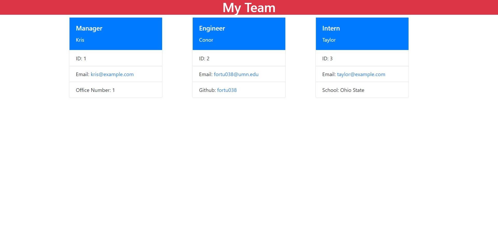

# Team_Profile_Generator

## Description

This project was done in order to get practice making unit tests, running programs through the terminal, and using classes and subclasses. The program creates an HTML file for a website that contains information about the team members of a project. The information on team members is provided by user input in the terminal. During this project I learned how to create unit tests and how to create classes and subclasses in JavaScript. I also practiced running programs through the terminal.

## Installation

The modules inquirer (version 8.2.4) and jest must be installed using npm and the runtime Node.js must be installed.

## Usage

This program can be used to create a website that displays a groups team members. Each team member will have their role, name, and ID number displayed and their email linked and displayed, while managers will have their office number displayed, engineers will have their Github account linked and displayed, and interns will have their school display. The user provides this information by the terminal, typing out answers to questions as they are shown in it. The user may add as many intern and engineer team members as they wish but may only have one manager.

## Credits

N/A

## License

Please refer to the license in the repo

## Links and Images

Github Repo URL: https://github.com/fortu038/Team_Profile_Generator

Walkthrough Video URL: "https://drive.google.com/file/d/1hZ1ZsIgX8NVvUTKcH3EjpBHytNCekkqG/view"

